# Last Order Dota2 Solo AI

该库提供一个由强化学习训练出的Dota2影魔solo智能体。该智能体通过自我对战的训练方式训练，从随机动作开始学习复杂的策略。玩家可以与该智能体进行影魔solo对战。

# 对战规则

1.物品方面不可以出凝魂之露，灵魂之戒，魔瓶，真眼。

2.不可以吃符，或使用魔瓶吃符。不可以使用塔防。

3.一局比赛最⻓时限为10分钟，超时将自动杀死重开房间。

4.游戏不能暂停。

# 配置文件

（以Windows为例）

1. 修改play_with_human_local.py中的Dota2客户端路径。

   根据下图路径的示例修改为对应路径。

   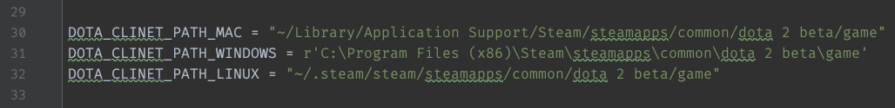

   Dota2客户端路径可根据下图指引找到：

   从team库中找到小齿轮图标，点击并进入属性界面。

   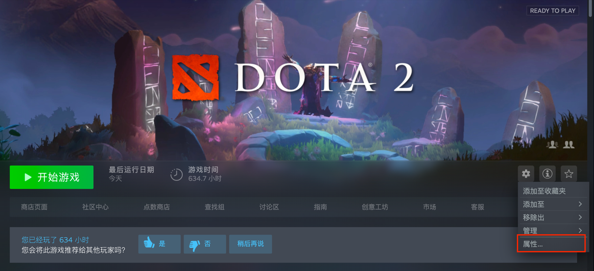

   点击本地文件然后再点击浏览即可打开Dota2客户端所在文件夹。

   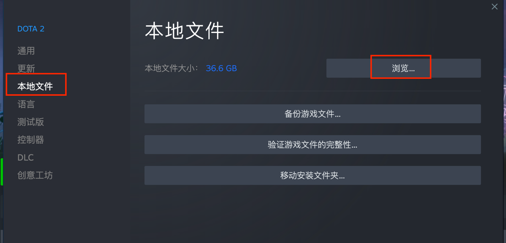

2. 安装python3

   下载python3.8的安装包：https://www.python.org/ftp/python/3.8.10/python-3.8.10-amd64.exe

   双击安装包，第一个页面在红线所示位置选中复选框，然后点击Install Now进行安装。

   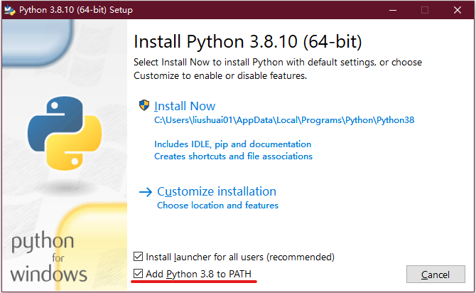

3. 安装依赖环境

   在开始菜单找到powershell，右键点击以管理员模式运行。

   首先进入此项目根目录（以D盘为例，如果last_order文件夹在E盘，则把D改为E）：
    
   `cd D:\last_order`

   然后依次执行下面命令：

   `pip config set global.index-url https://mirrors.aliyun.com/pypi/simple`

   `pip install -r .\requirements.txt`

   等待安装完毕。

   安装完成后，执行下面命令即可启动游戏，详情请看下一节。

   `python .\play_with_human_local.py`

# 启动对战

首先启动steam。

在上面说明中安装好python3.8和依赖库之后，在管理员模式运行的 powershell 进入项目根目录。执行下面命令即可启动游戏。

`python .\play_with_human_local.py`

后系统将自动启动Dota2客户端。

然后根据以下图片指引开启对战。

在客户端首页点击开始DOTA：

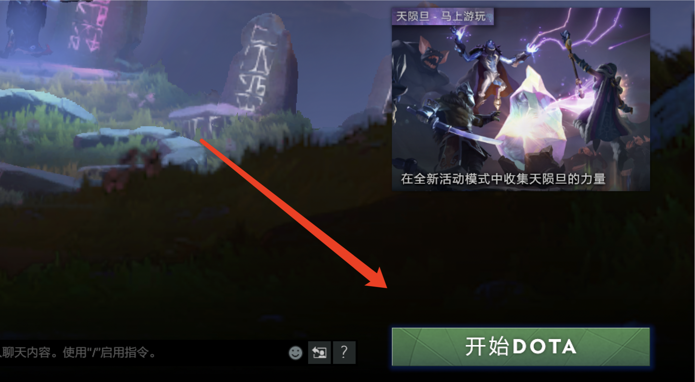

选择创建比赛房间：

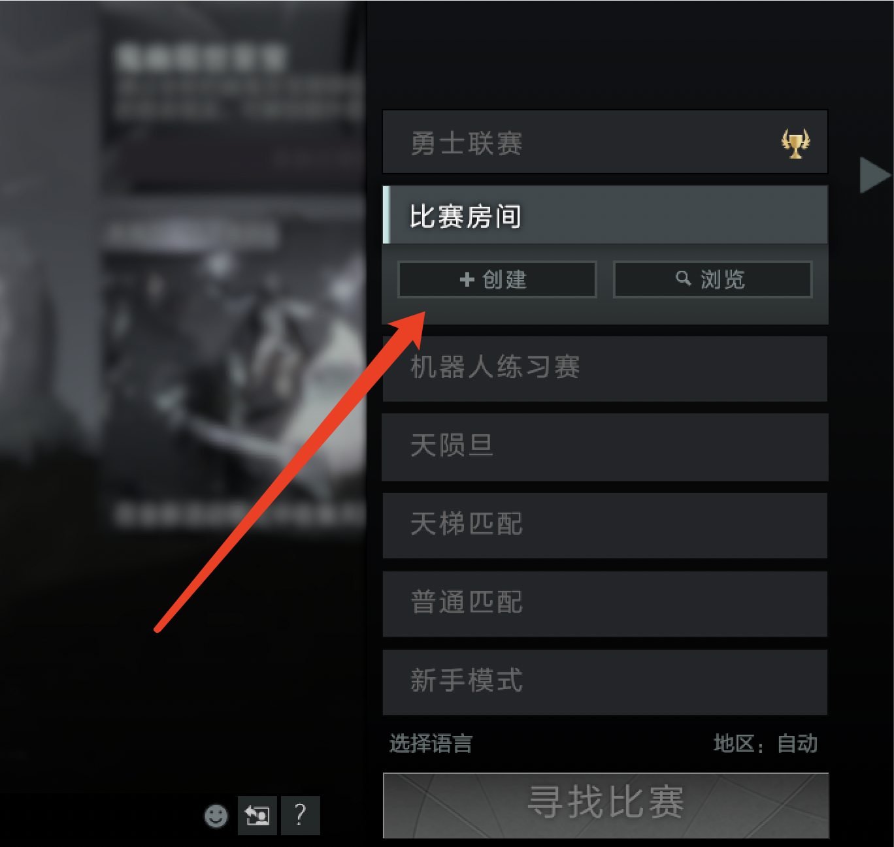

选择夜魇队伍并点击编辑：

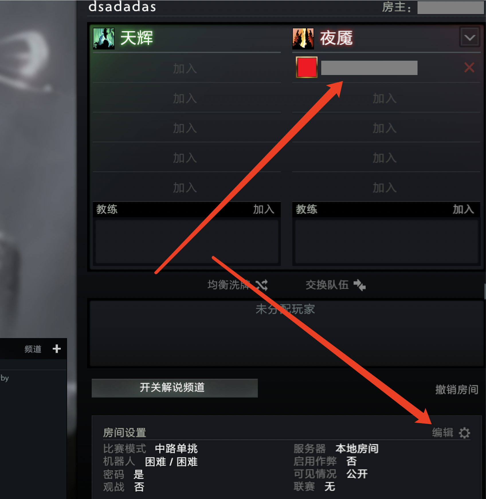

检查房间设置是否与下图红框一致：

最后选择影魔即可开启对战：

# Additional links 

https://arxiv.org/abs/1912.06680

https://github.com/TimZaman/dotaservice

https://developer.valvesoftware.com/wiki/Dota_Bot_Scripting

---
---

# Last Order Dota2 Shadow Fiend Solo AI

This library provides a Dota 2 Shadow Fiend solo AI trained by reinforcement learning. Shadow Fiend solo AI is trained to learn complex strategies starting with random actions through self play training. Players can play Shadow Fiend against this AI.

# Rules

1. No Infused Raindrops, Soul Ring, Bottle or Sentry Ward.

2. You should not use runes or Glyph of Fortification.

3. The maximum time limit for a game is 10 minutes, and the dota2 client will be automatically killed and reopened after the time limit.

4. The game cannot be paused.

# Configuration file

(Take Windows as an example)

1. Modify the path of Dota2 client in play_with_human_local.py.

   Modify it to the corresponding path according to the example of the path below.

   

   The Dota2 client path can be found according to the following guidelines.

   Find Dota2 from the TEAM library, right click on it and go to the properties screen.

   Click on the local files and then click on Browse... to open the folder where the Dota 2 client is located.

2. Install python3

   Download the python 3.8 installation package: https://www.python.org/ftp/python/3.8.10/python-3.8.10-amd64.exe

   Double-click the installer, check the checkbox on the first page where the red line is, and then click Install Now to install.

   

3. Install the dependencies

   Find powershell in the start menu, right click on it and run it in administrator mode.

   First go to the root directory of this project (take the D:\ drive as an example, if the last_order folder is on the E:\ drive, change D to E).
    
   `cd D:\last_order`

   Then execute the following commands in sequence.

   `pip config set global.index-url https://mirrors.aliyun.com/pypi/simple`

   `pip install -r .\requirements.txt`

   Wait for the installation to complete.

   Once the installation is complete, execute the following command to start the game, see the next section for details.

   `python .\play_with_human_local.py`

# Start the game

First open steam.

After installing python 3.8 and the dependencies in the above instructions, run powershell in admin mode and enter the project root directory. Execute the following command to start the game.

`python .\play_with_human_local.py`

After that the system will automatically start the Dota2 client.

Then follow the instructions in the image below to start the game.

On the first page of the client, click on PLAY DOTA.

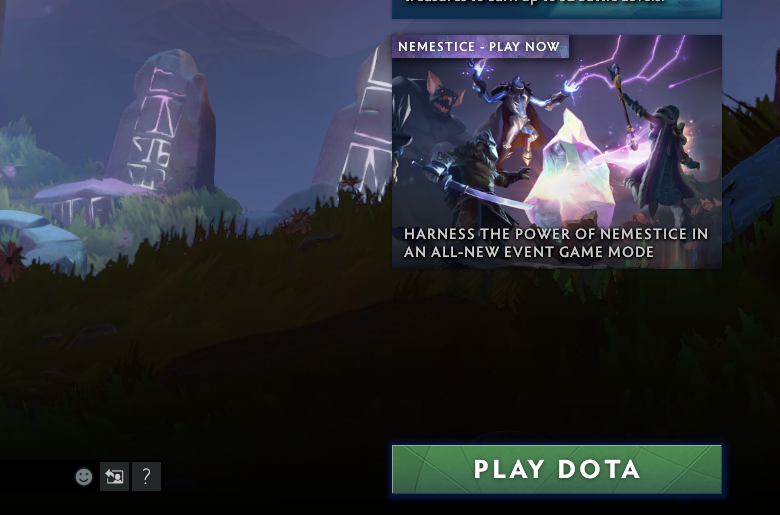

Select CUSTOM LOBBIES and click CREATE.

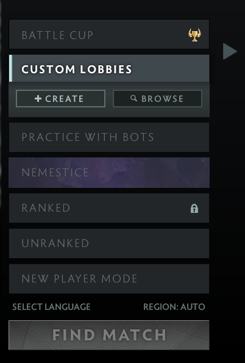

Select The Dire team and click EDIT:

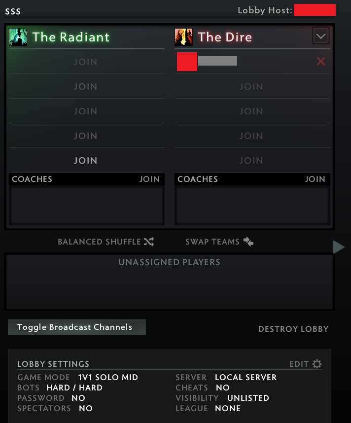

Check and change the lobby settings to match the following image:

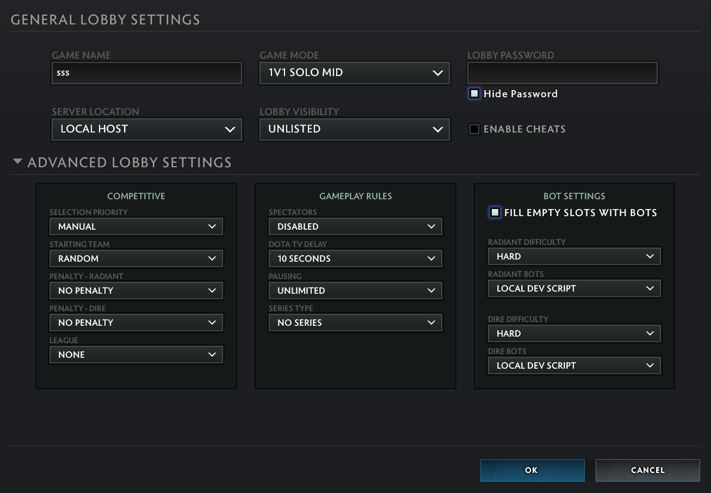

Finally, select Shadow Fiend to start the game: 

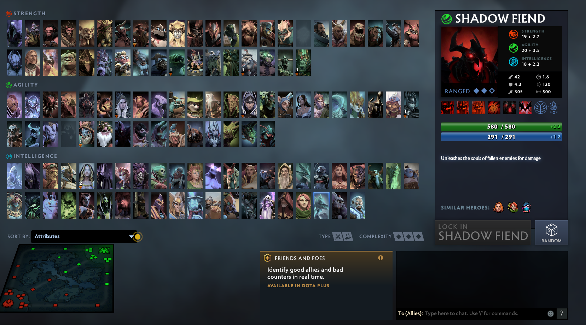

# Additional links 

https://arxiv.org/abs/1912.06680

https://github.com/TimZaman/dotaservice

https://developer.valvesoftware.com/wiki/Dota_Bot_Scripting
